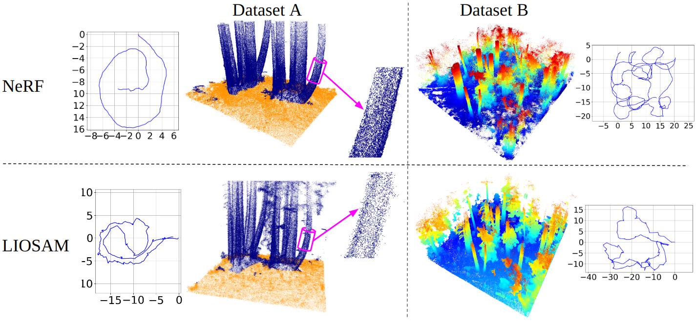

# RedwoodNeRF

**A Python toolbox for NeRF-accelerated forest assessment**

## Datasets

We provide two datasets totaling in 540 m<sup>2</sup> of coastal California mixed-evergreen Redwood forest. This study area belonds to the Forest Ecology Research Plot [FERP](https://ferp.ucsc.edu/), a globally recognized ForestGEO plot spanning 16 ha and over 51,000 recorded stem diameters. All point clouds are in world scale, but the NeRF recostructions must undergo a transformation provided in an associated file called dataparser_transforms.json.

    - Dataset A [Google Drive](https://drive.google.com/drive/folders/1rQmtVUJi9qQjlghXKGOm1CcTNm6VPVr3?usp=sharing)
    - Dataset B [Google Drive](https://drive.google.com/drive/folders/1CImtfqJrG6I10a1rviMSFG-kYs1-KCt4?usp=sharing)
<p align='center'>
    
</p>

## Tree segmenation and modeling (coming soon...)

Our software tools are built on top of [TreeTool](https://github.com/porteratzo/TreeTool), a Python library for estimating tree diameters from dense forest reconstructions. We provide a full add-on library which expands TreeTool's viability for irregular tree shapes and complex tree growth patterns. We also introduce an improved tree modeling approach which uses stacks of convex-hull slices to accuratley represent irregular tree morphologies.

<p align='center'>
    
</p>

## Paper

This effort is based on our paper which is currently under review. Please cite our preprint if you use the provided code or datasets.
```
@article{RedwoodNeRF2024,
  title     = {NeRF-Accelerated Ecological Monitoring in Mixed-Evergreen Redwood Forest},
  author    = {Adam Korycki, Cory Yeaton, Gregory S. Gilbert, Colleen Josephson, Steve McGuire},
  journal   = {arXiv preprint arXiv:XXXX.XXXXX},
  year      = {2024},
  url       = {https://arxiv.org/abs/XXXX.XXXXX},
}
```

Please also cite [TreeTool](https://github.com/porteratzo/TreeTool).
```
@article{montoya2021treetool,
  title={TreeTool: A tool for detecting trees and estimating their DBH using forest point clouds},
  author={Montoya, Omar and Icasio-Hernandez, Octavio and Salas, Joaquin},
  journal={SoftwareX},
  volume={16},
  pages={100889},
  year={2021},
  publisher={Elsevier}
}
```